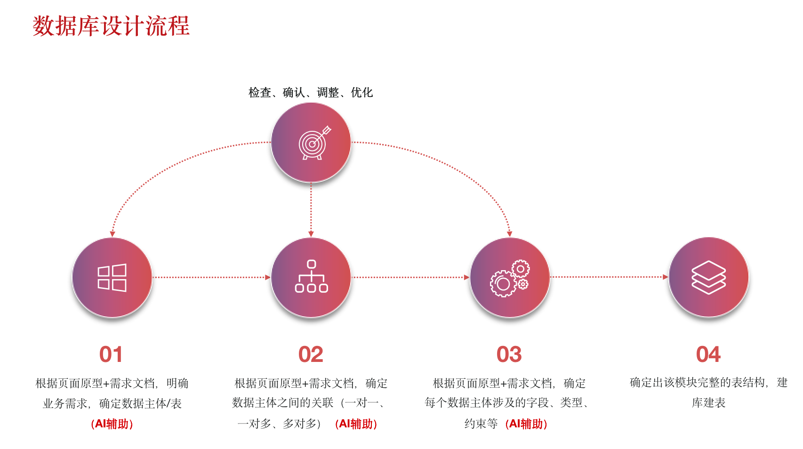
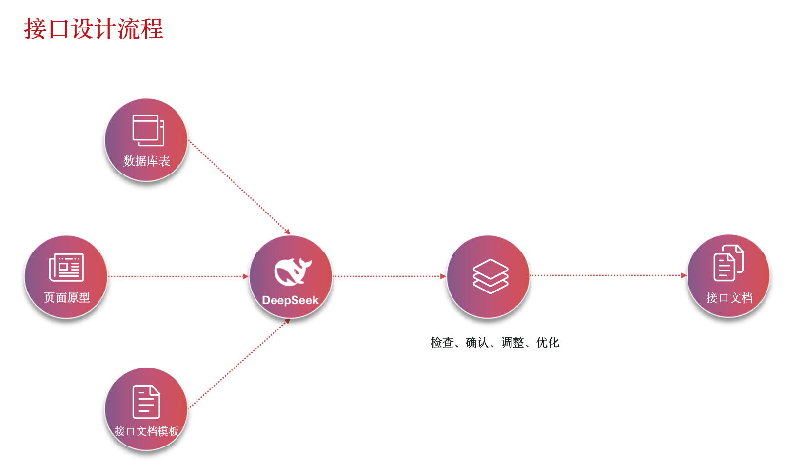

# 密码助手

# 1.概述

# 2.数据库


## 2.1 用户表(t_user)

```sql
-- ----------------------------
-- Table structure for t_user
-- ----------------------------

DROP TABLE IF EXISTS `t_user`;
CREATE TABLE `t_user` (
  `id` int(11) NOT NULL AUTO_INCREMENT COMMENT '用户ID，自增',
  `username` varchar(64) NOT NULL COMMENT '用户名',
  `email` varchar(64) NOT NULL COMMENT '电子邮件地址',
  `password` varchar(64) NOT NULL COMMENT '密码',
  `salt` varchar(64) NOT NULL COMMENT '密码盐值',
  `signature` varchar(256) DEFAULT NULL COMMENT '个性签名',
  `status` varchar(1) DEFAULT '0' COMMENT '用户状态： 0-在用,1-无效',
  `avatar_url` varchar(1024) DEFAULT NULL COMMENT '头像',
  `created_time` timestamp NULL DEFAULT CURRENT_TIMESTAMP COMMENT '创建时间',
  `updated_time` timestamp NULL DEFAULT CURRENT_TIMESTAMP ON UPDATE CURRENT_TIMESTAMP COMMENT '更新时间',
  PRIMARY KEY (`id`),
  UNIQUE KEY `idx_username` (`username`),
  UNIQUE KEY `idx_email` (`email`)
) ENGINE=InnoDB AUTO_INCREMENT=6 DEFAULT CHARSET=utf8mb4;

SET FOREIGN_KEY_CHECKS = 1;
```


## 2.2 密码记录表（t_password_record）

```sql
-- ----------------------------
-- Table structure for t_password_record
-- ----------------------------

DROP TABLE IF EXISTS `t_password_record`;
CREATE TABLE `t_password_record` (
  `id` int(11) NOT NULL AUTO_INCREMENT COMMENT '记录ID，自增',
  `user_id` int(11) NOT NULL COMMENT '用户ID，关联t_user表',
  `platform_name` varchar(64) NOT NULL COMMENT '平台名称',
  `platform_icon` varchar(1024) DEFAULT NULL COMMENT '平台图标',
  `description` varchar(256) DEFAULT NULL COMMENT '描述信息',
  `password` varchar(64) NOT NULL COMMENT '密码',
  `created_time` timestamp NULL DEFAULT CURRENT_TIMESTAMP COMMENT '创建时间',
  `updated_time` timestamp NULL DEFAULT CURRENT_TIMESTAMP ON UPDATE CURRENT_TIMESTAMP COMMENT '更新时间',
  PRIMARY KEY (`id`),
  KEY `idx_user_id` (`user_id`)
) ENGINE=InnoDB DEFAULT CHARSET=utf8mb4;
```


# 3.平台依赖环境信息

3.1 依赖Redis

3.2 依赖minio

3.3 依赖mysql


4.AI 使用技巧

4.1 后端生成接口代码

前置内容准备

Deepseek完成

1.使用Deepseek根据需求文档，生成数据库表。

2.


1.先开发一套模板(Controller、Service、Mapper.xml)，AI选择核心文件

2.根据现有的模板导出接口，提供接口给AI作为接口模板

3.使用Deepseek设计的表，提供给AI

4.描述表的关联关系

5.根据内容生成，生成接口AI


数据库表生成流程



接口设计流程




